# Web Solution With WordPress

## Step 1 - Prepare a Web Server

1\.  Launch a RedHat EC2 instance that serve as Web Server. Create 3 volumes in the same AZ as the web server ec2 each of 10GB and attache all 3 volumes one by one to the web server.

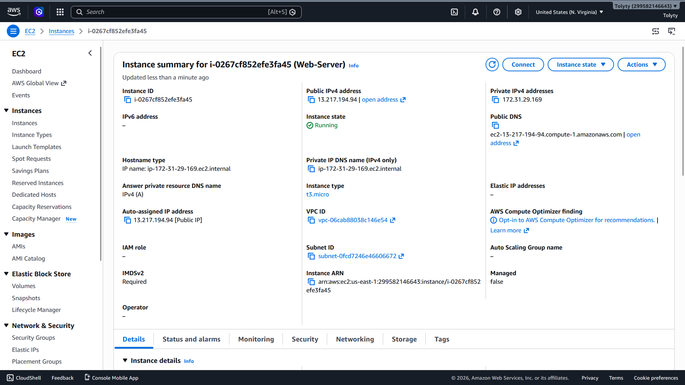  
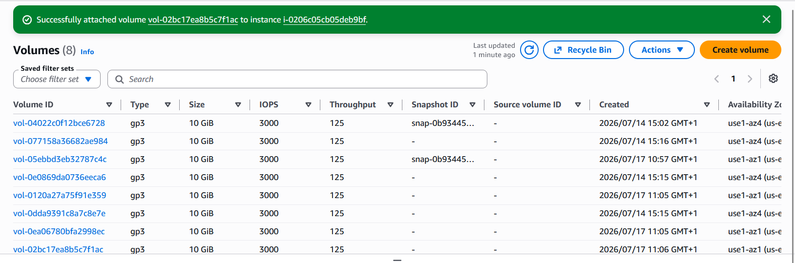

2.  Open up the Linux terminal to begin configuration.

```
ssh -i "mean-key.pem" ec2-user@ec2-13-217-194-94.compute-1.amazonaws.com
```
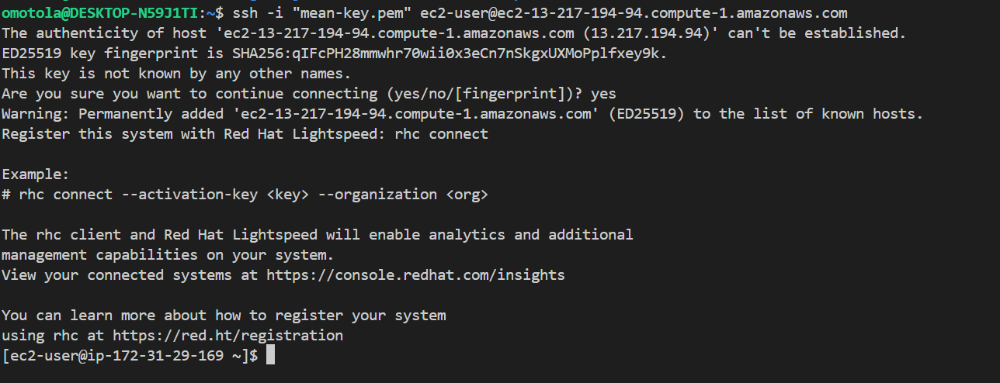

3\. Use `lsblk` to inspect what block devices are attached to the server. All devices in Linux reside in /dev/ directory. Inspect with `ls /dev/` and ensure all 3 newly created devices are there. Their name will likely be `nvme1n1`, `nvme2n1` and `nvme3n1`.

```
lsblk
```

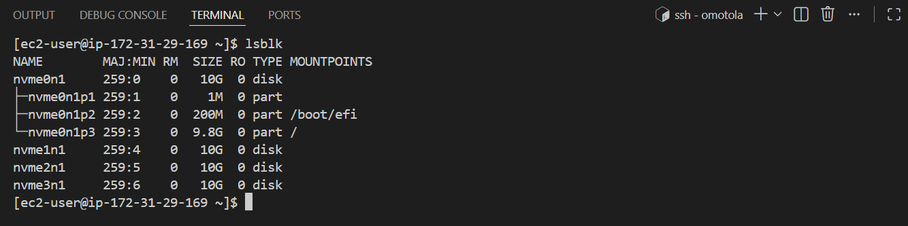  

4\. Use `df -h` to see all mounts and free space on the server.

```
df -h
```
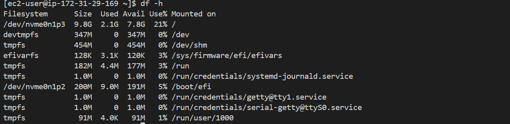

5a\. Use `fdisk` utility to create a single partition on each of the 3 disks.

```
sudo fdisk /dev/nvme1n1
```

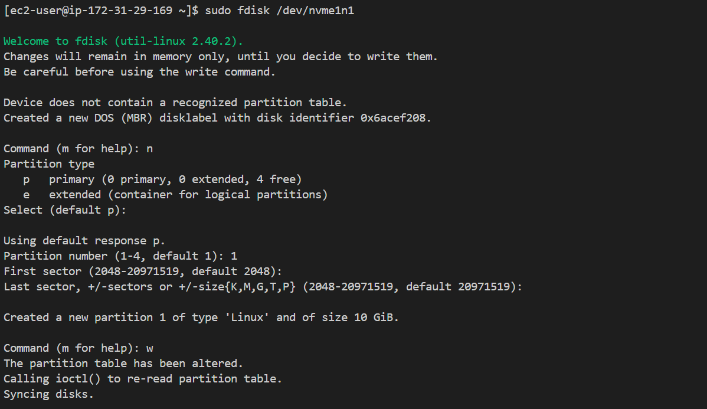
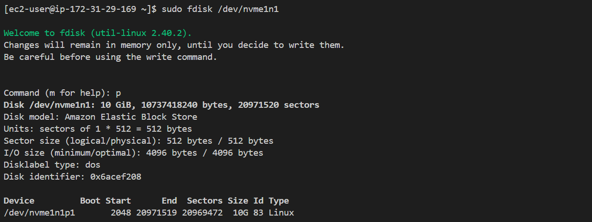


```
sudo fdisk /dev/nvme2n1
```

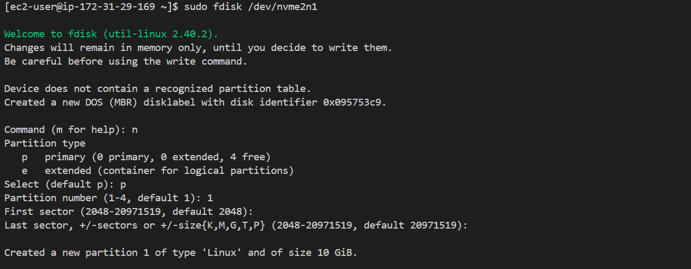
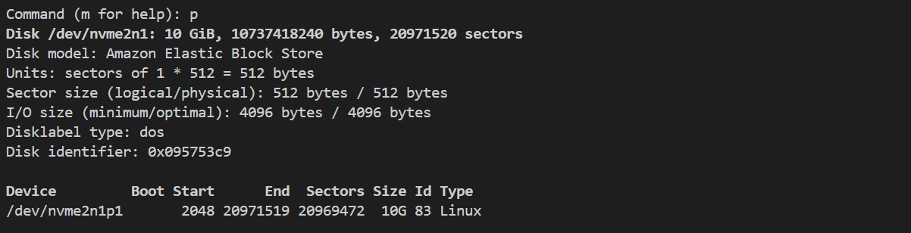

```
sudo fdisk /dev/nvme3n1
```

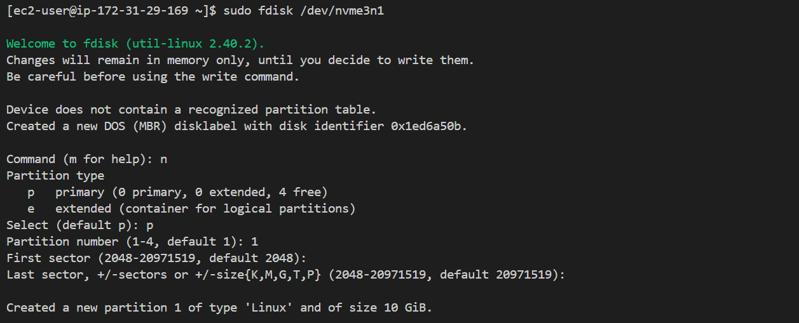
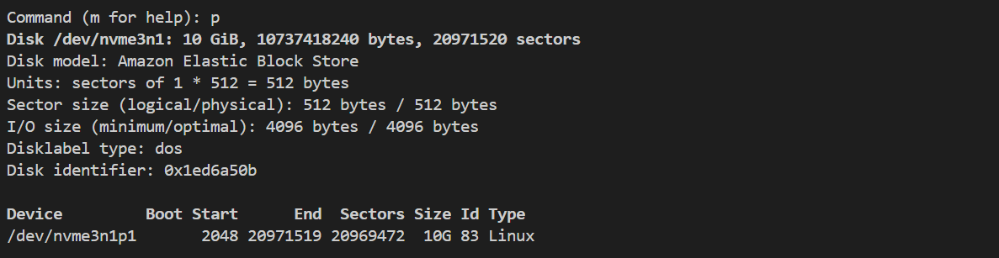

5b\. Use `lsblk` utility to view the newly configured partitions on each of the 3 disks

    lsblk

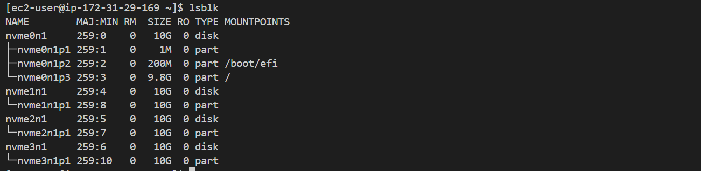


6.  Install `lvm` package

sudo yum install lvm2 -y

7\.  Use `pvcreate` utility to mark each of the 3 dicks as physical volumes (PVs) to be used by LVM. Verify that each of the volumes have been created successfully.

```
sudo pvcreate /dev/nvme1n1p1 /dev/nvme2n1p1 /dev/nvme3n1p1
```
```
sudo pvs
```
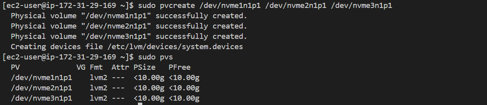

8\. Use `vgcreate` utility to add all 3 PVs to a volume group (VG). Name the VG `webdata-vg`. Verify that the VG has been created successfully

```
sudo vgcreate webdata-vg /dev/nvme1n1p1 /dev/nvme2n1p1 /dev/nvme3n1p1
```
```
sudo vgs
```

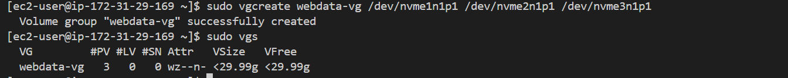

9\. Use `lvcreate` utility to create 2 logical volume, `apps-lv` (Use half of the PV size), and `logs-lv` (Use the remaining space of the PV size). Verify that the logical volumes have been created successfully.

Note: apps-lv is used to store data for the Website while logs-lv is used to store data for logs.

```
sudo lvcreate -n apps-lv -L 14G webdata-vg
sudo lvcreate -n logs-lv -L 14G webdata-vg
sudo lvs
```
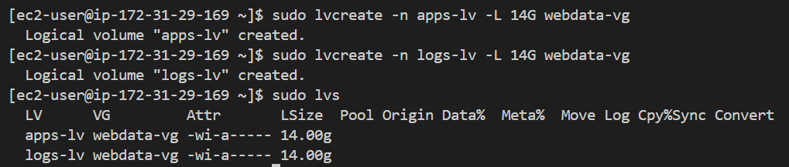

10a. Verify the entire setup

```
sudo vgdisplay -v   
#view complete setup, VG, PV and LV
```

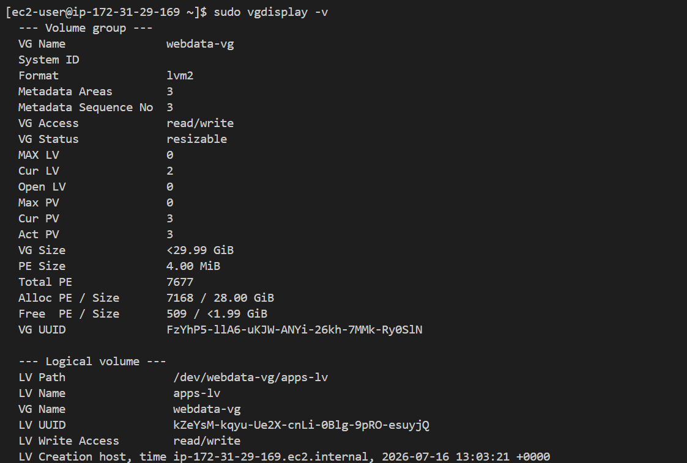
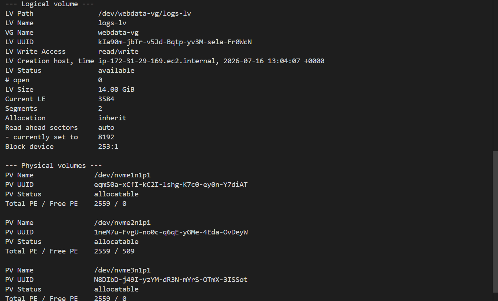


```
lsblk
```
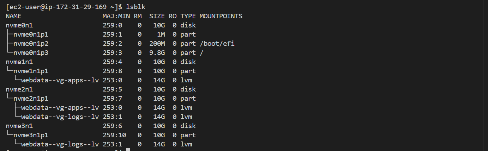

10b. Use `mkfs.ext4` to format the logical volumes with ext4 filesystem

```
sudo mkfs.ext4 /dev/webdata-vg/apps-lv
sudo mkfs.ext4 /dev/webdata-vg/logs-lv
```

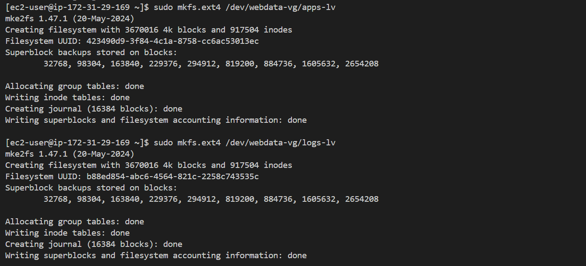

11\. Create `/var/www/html` directory to store website files and `/home/recovery/logs` to store backup of log data

```
sudomkdir -p /var/www/html
sudomkdir -p /home/recovery/logs
```

Mount /var/www/html on apps-lv logical volume

```
sudo mount /dev/webdata-vg/apps-lv /var/www/html
```


12\. Use `rsync` utility to backup all the files in the log directory `/var/log` into `/home/recovery/logs` (This is required before mounting the file system)

```
sudo rsync -av /var/log /home/recovery/logs
```
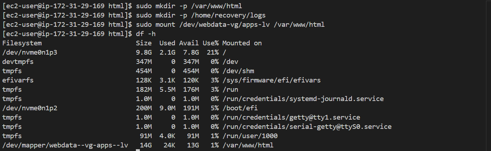

13\. Mount `/var/log` on `logs-lv` logical volume (All existing data on /var/log is deleted with this mount process which was why the data was backed up)

```
sudo mount /dev/webdata-vg/logs-lv /var/log
ls -l /var/log
```
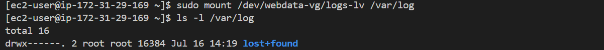

14\. Restore log file back into `/var/log` directory

```
sudo rsync -av /home/recovery/logs/log/ /var/log
```
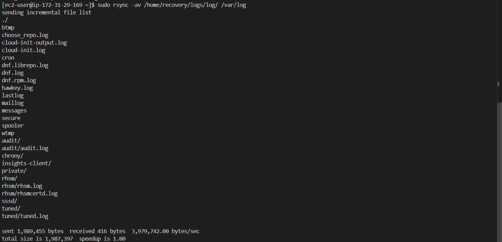

15\. Update `/etc/fstab` file so that the mount configuration will persist after restart of the server

Get the `UUID` of the device and Update the `/etc/fstab` file with the format shown inside the file using the `UUID`. Remember to remove the leading and ending quotes.

```
sudo blkid   
# To fetch the UUID
```
```
sudo vim /etc/fstab
```

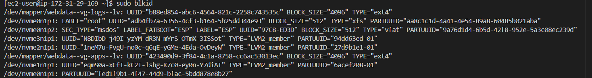

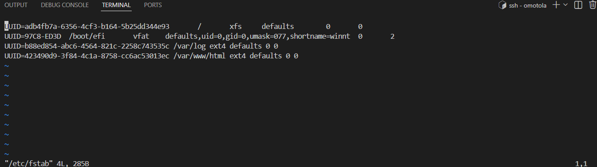

16\. Test the configuration and reload daemon. Verify the setup

```
sudo mount -a   
# Test the configuration
```        

```
sudo systemctl daemon-reload
```

```
df -h
# Verifies the setup
```
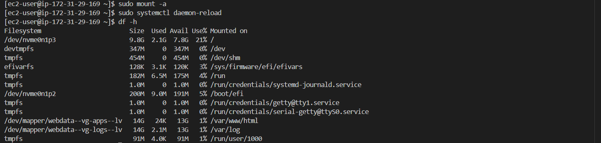


## Step 2 - Prepare the Database Server

Launch a second RedHat EC2 instance that will have a role - DB Server. Repeat the same steps as for the Web Server, but instead of `apps-lv`, create `dv-lv` and mount it to `/db` directory.

1\. Create 3 volumes in the same AZ as the DB Server ec2 each of 10GB and attache all 3 volumes one by one to the DB Server.

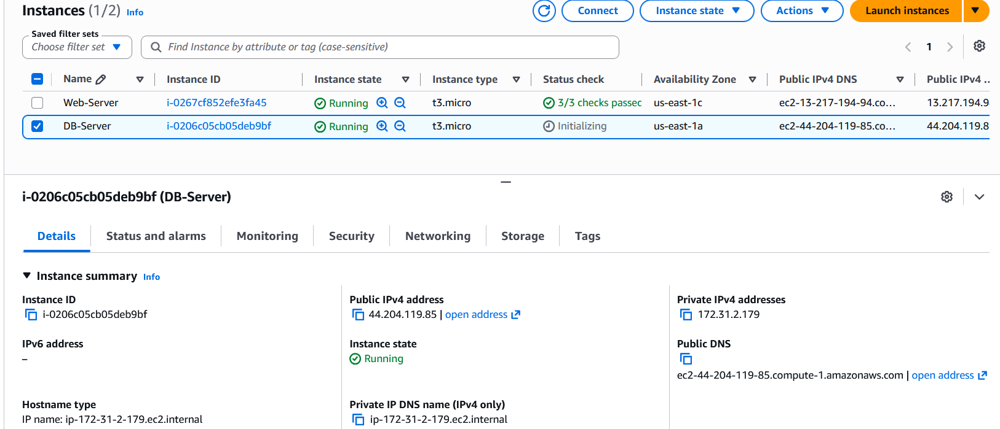

2\.  Open up the Linux terminal to begin configuration.

```
ssh -i "mean-key.pem" ec2-user@ec2-44-204-119-85.compute-1.amazonaws.com
```

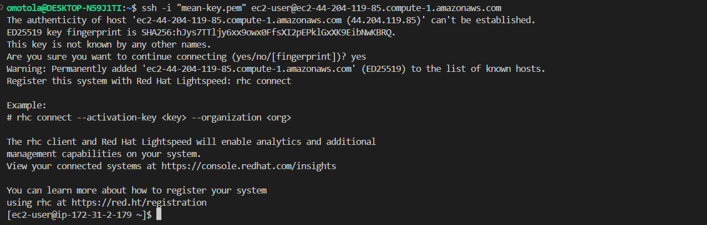

3\. Use `lsblk` to inspect what block devices are attached to the server. Their names will likely be `nvme1n1`, `nvme2n1` and `nvme3n1`.

```
lsblk
```
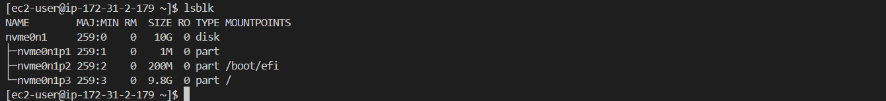

4a\. Use `fdisk` utility to create a single partition on each of the 3 disks.

```
sudo fdisk /dev/nvme1n1
```

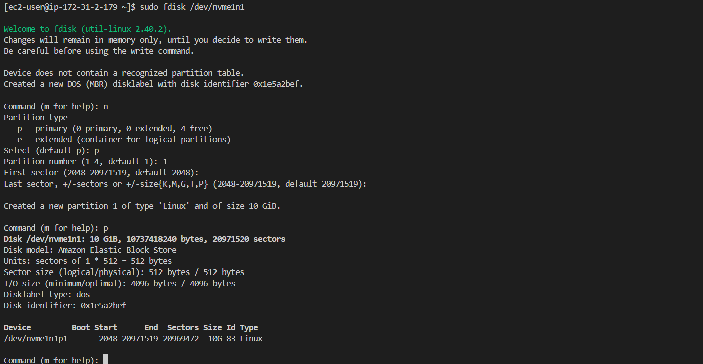

```
sudo fdisk /dev/nvme2n1
```
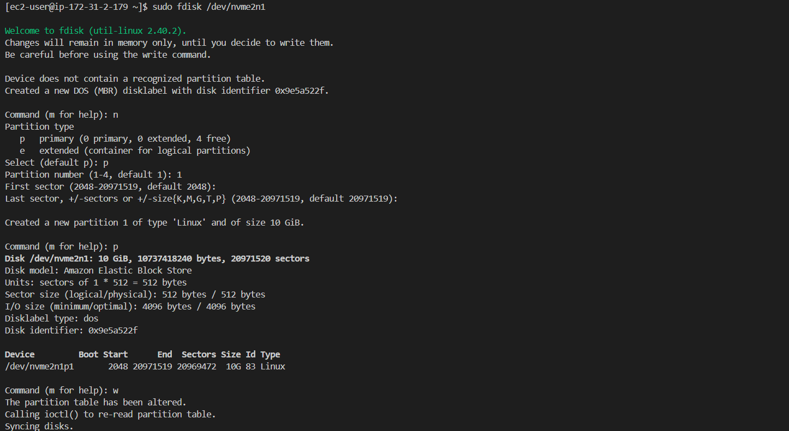

```
sudo fdisk /dev/nvme3n1
```
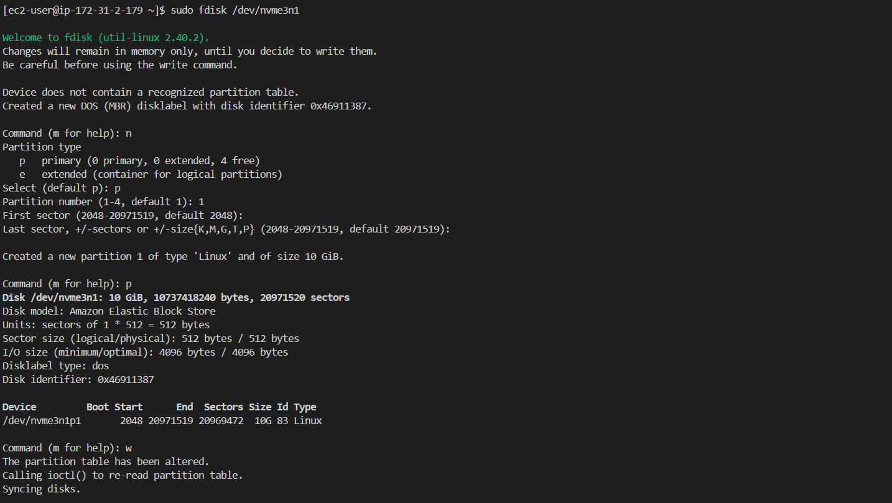

4b. Use `lsblk` utility to view the newly configured partitions on each of the 3 disks

    lsblk

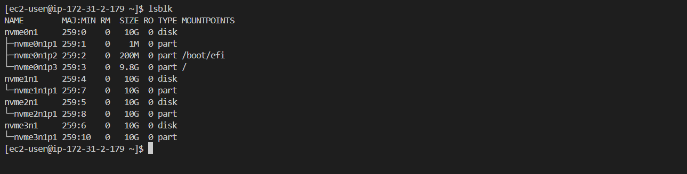

5\.  Install `lvm` package

```
sudo yum install lvm2 -y
```

6\.  Use `pvcreate` utility to mark each of the 3 dicks as physical volumes (PVs) to be used by LVM. Also, use `vgcreate` utility to add all 3 PVs to a volume group (VG). Name the VG `database-vg`. Verify that each of the volumes and the VG have been created successfully.

```
sudopvcreate /dev/nvme1n1p1 /dev/nvme2n1p1 /dev/nvme3n1p1
```
```
sudo pvs
```

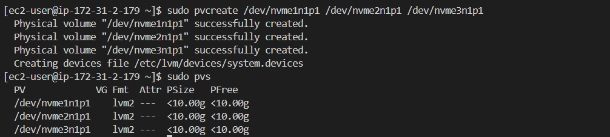

```
sudo vgcreate database-vg /dev/nvme1n1p1 /dev/nvme2n1p1 /dev/nvme3n1p1
```
```
sudo vgs
```
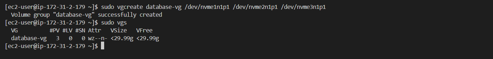

7\.  Use `lvcreate` utility to create a logical volume, `db-lv` (Use 20G of the PV size since it is the only LV to be created). Verify that the logical volumes have been created successfully.

```
sudo lvcreate -n db-lv -L 20G database-vg
```
```
sudo lvs
```
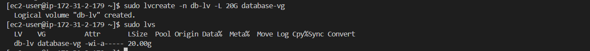

8\. Use `mkfs.ext4` to format the logical volumes with ext4 filesystem and mount `db-lv` on `/db`

```
sudo mkfs.ext4 /dev/database-vg/db-lv
```

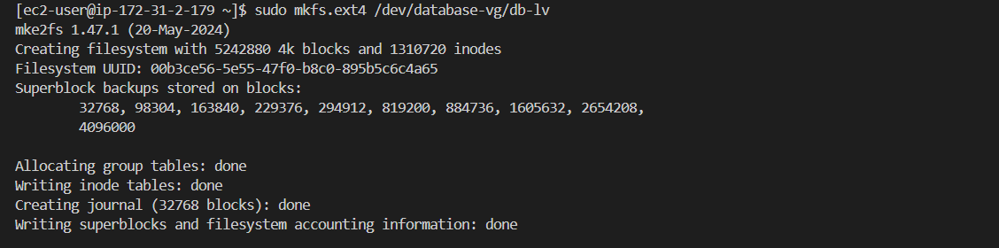

Create `db` directory first

```
sudo mkdir /db
```
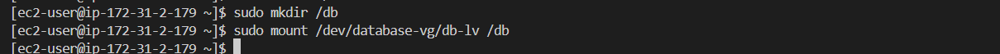

```
sudo mount /dev/database-vg/db-lv /db
```
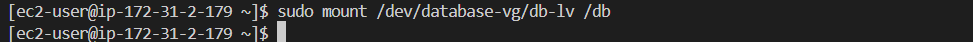

9\. Update `/etc/fstab` file so that the mount configuration will persist after restart of the server

Get the `UUID` of the device

```
sudo blkid
```

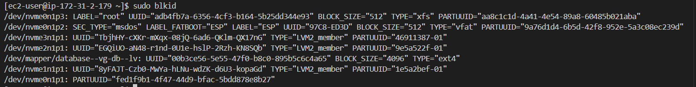

Update the `/etc/fstab` file with the format shown inside the file using the `UUID`. Remember to remove the leading and ending quotes.

```
sudo vi /etc/fstab
```


10\. Test the configuration and reload daemon. Verify the setup

```
sudo mount -a 
# Test the configuration
```
```
sudo systemctl daemon-reload
```
```
df -h   
# Verifies the setup
```
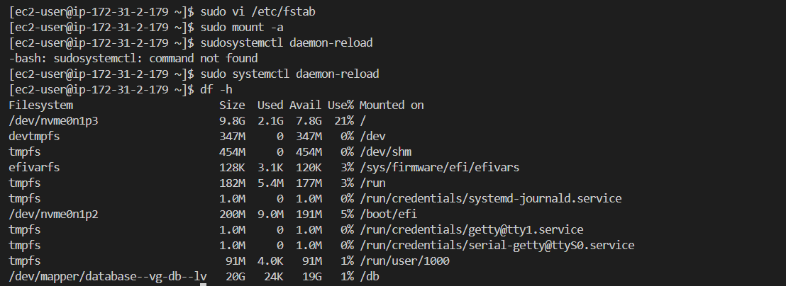

## Storage Setup & Partition Table Correction

During the storage configuration phase on both the **Web Server** and **Database Server**, the EBS volumes were partitioned and configured using Logical Volume Manager (LVM).

### Challenge Encountered
The disk partitions were initially created using `fdisk`, which uses the older **MBR (dos)** partition style by default. To align with modern infrastructure standards and support future disk expansion beyond 2TB, the partition table needed to be converted to **GPT (GUID Partition Table)** without losing the LVM structure or mount configurations.

### Resolution Steps Executed

1a\. **Unmounted Active Mount Points for the Web Server:**

```
sudo umount -l /var/www/html
```

```
sudo umount -l /var/log
```

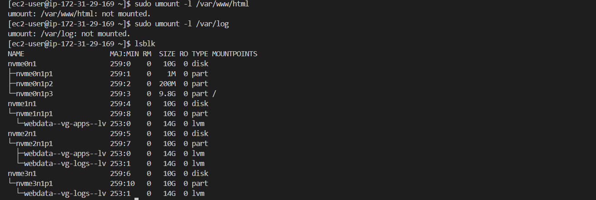

1\. Converted Disk Partition Table to GPT:

```
sudo fdisk /dev/nvme1n1
```

* Entered 'g' to create a new empty GPT partition table.

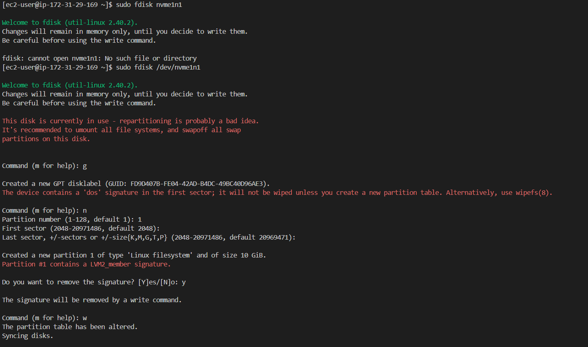

```
sudo fdisk /dev/nvme2n1
```
* Entered 'g' to create a new empty GPT partition table.

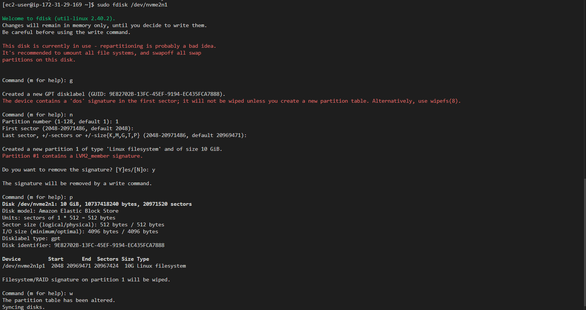

```
sudo fdisk /dev/nvme3n1
```
* Entered 'g' to create a new empty GPT partition table.

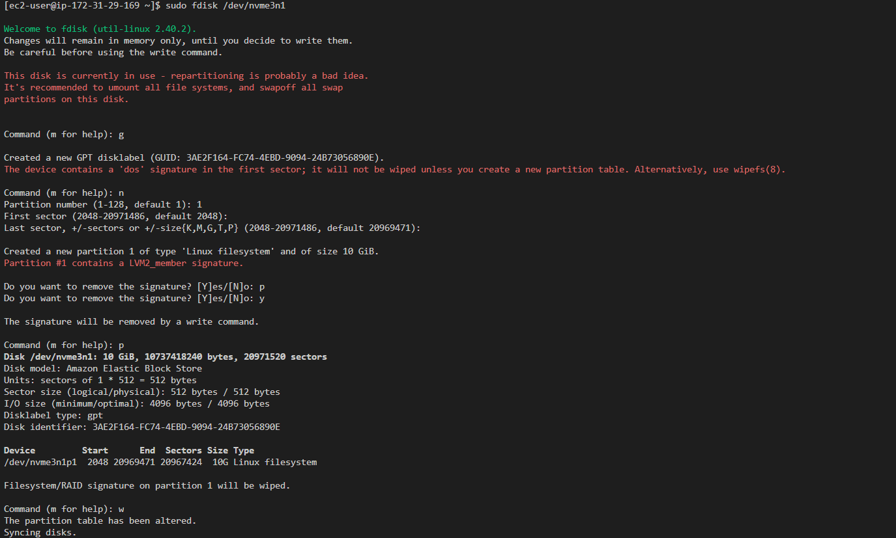

2\. Use `lsblk` utility to view the newly configured partitions on each of the 3 disks

```
lsblk
```

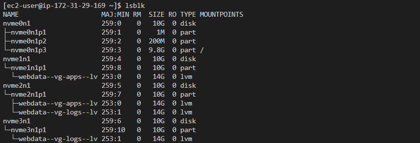

3\. Test the configuration and reload daemon. Verify the setup

```
sudo mount -a
```
```
sudo systemctl daemon-reload
```

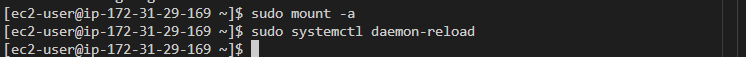


1b\. **Unmounted Active Mount Points for the Database Server:**

```
sudo umount -l /db
```

1\. Converted Disk Partition Table to GPT:

```
sudo fdisk /dev/nvme1n1
```

* Entered 'g' to create a new empty GPT partition table.

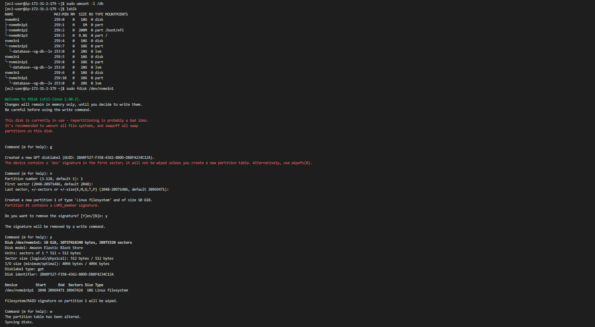


2\. Use `lsblk` utility to view the newly configured partitions on each of the disk

```
lsblk
```

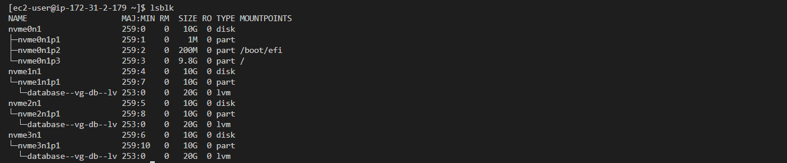

3\. Test the configuration and reload daemon. Verify the setup

```
sudo mount -a
```
```
sudo systemctl daemon-reload
```


## Step 3 - Install WordPress on the Web Server EC2

1\.  Update the repository

```
sudo yum -y update
```
2\.  Install wget, Apache and it's dependencies

```
sudo dnf -y install wget httpd php-json
```
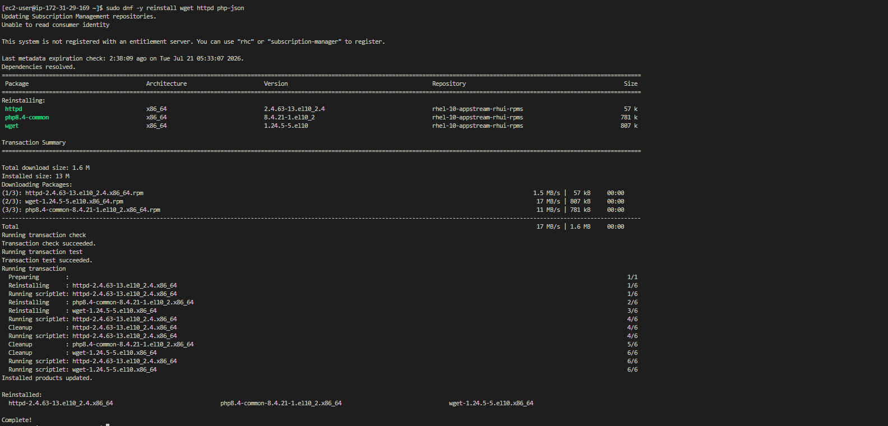

3\.  Install the latest version of PHP and it's dependencies using the Remi repository

Install the EPEL repository

The package manager `dnf` was used here. It generally offers better performance and more efficient dependency resolution. `dnf` is the modern, actively maintained package manager, while yum is older and gradually being phased out.

The system version of the RHEL EC2 is version "9"

```
 sudo dnf install https://dl.fedoraproject.org/pub/epel/epel-release-latest-9.noarch.rpm
```
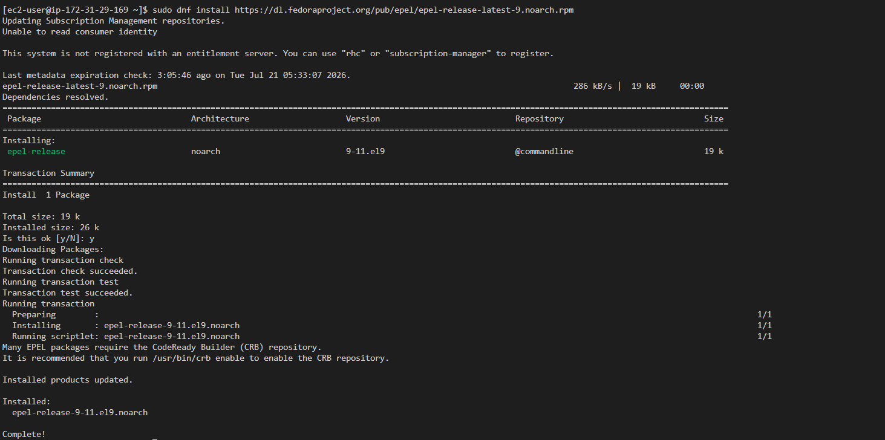

Install yum utils and enable remi-repository

```
sudo dnf install dnf-utils http://rpms.remirepo.net/enterprise/remi-release-9.rpm
```
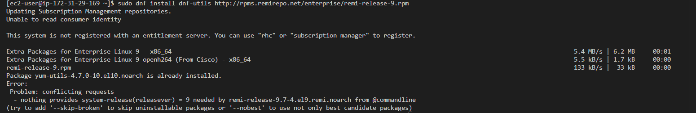

After the successful installation of yum-utils and Remi-packages, search for the PHP modules which are available for download by running the command.

```
sudo dnf module list php
```
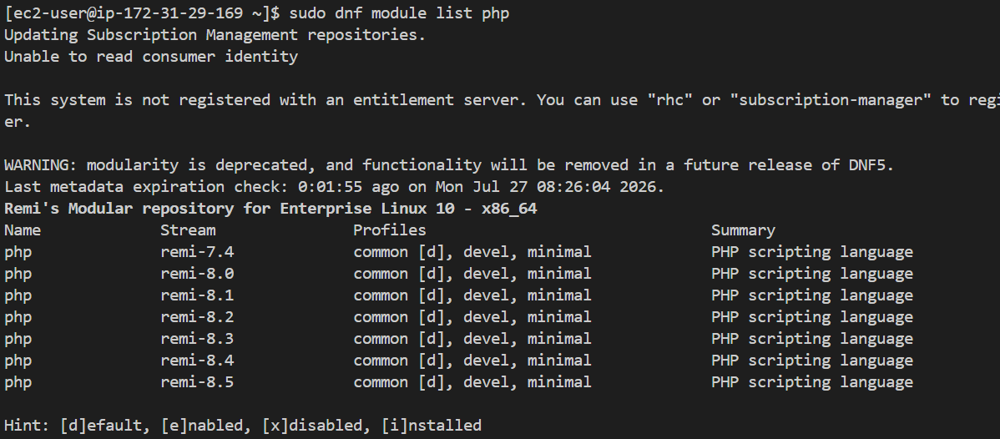

The output above indicates that if the currently installed version of PHP is PHP 8.1, there is need to install the newer release, PHP 8.2. 

Now enable the PHP 8.2 module by running

```
sudo dnf module enable php:remi-8.2
```

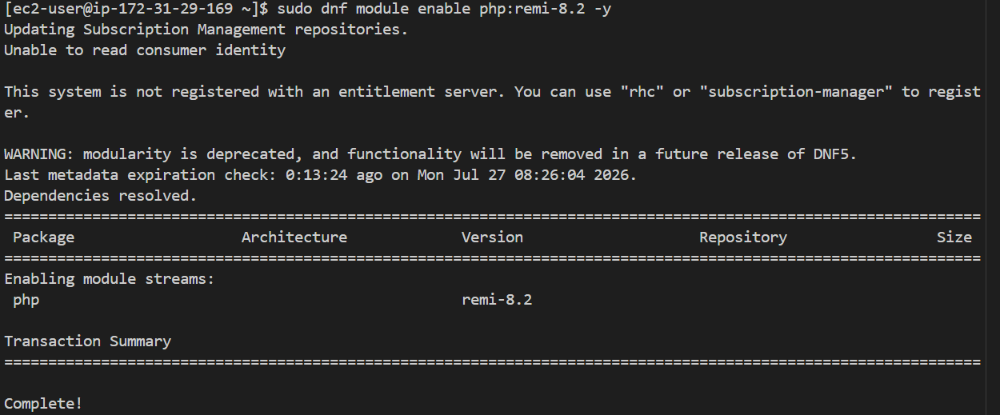
enable-php
Install PHP, PHP-FPM (FastCGI Process Manager) and associated PHP modules using the command.

```
sudo dnf install phpphp-opcachephp-gdphp-curl php-mysqlnd
```
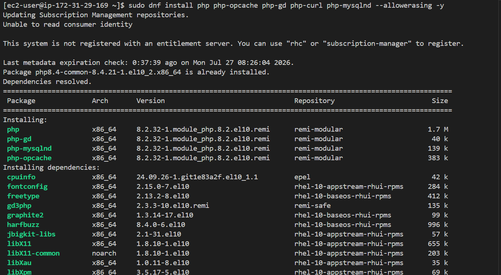

To verify the version installed to run.

```
php -v
```
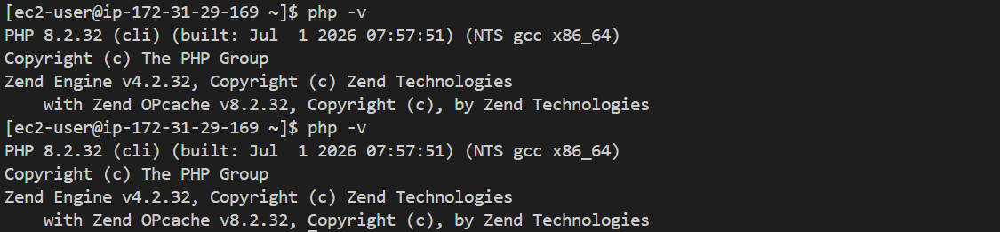

Start, enable and check status of PHP-FPM on boot-up.

```
sudo systemctl start php-fpm
sudo systemctl enable php-fpm
sudo systemctl status php-fpm
```
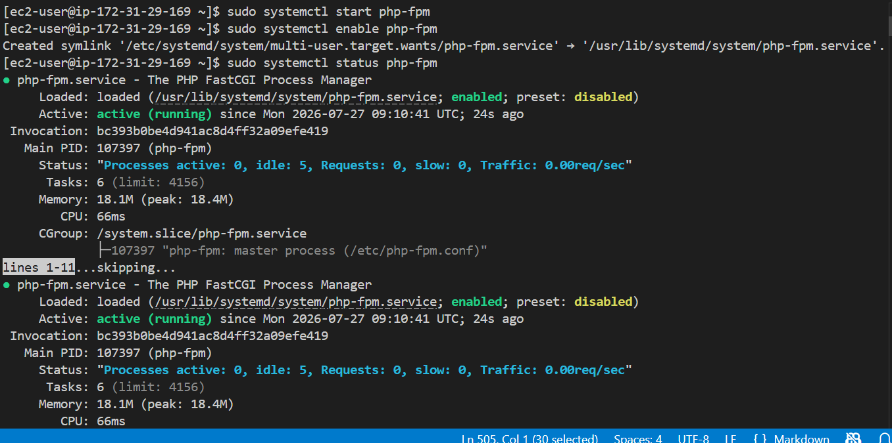

4\.  Configure SELinux Policies

To instruct SELinux to allow Apache to execute the PHP code via PHP-FPM run.

```
sudo chown -R apache:apache /var/www/html
sudo chcon -t httpd_sys_rw_content_t /var/www/html -R
sudo setsebool -P httpd_execmem 1
sudo setsebool -P httpd_can_network_connect=1
sudo setsebool -P httpd_can_network_connect_db=1
```
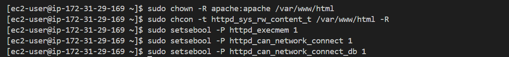

Restart Apache web server for PHP to work with Apache web server.

```
sudo systemctl restart httpd
```

Test to see the default Apache page on a browser using the public IP address

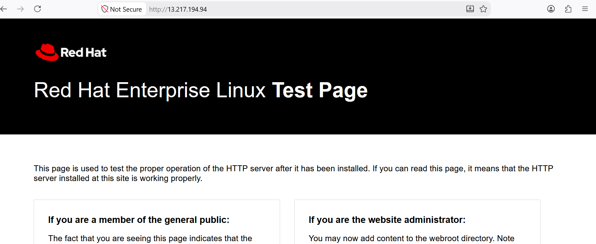

5\.  Download WordPress

Download wordpress and copy wordpress content to /var/www/html

```
sudo mkdir wordpress && cd wordpress
sudo wget http://wordpress.org/latest.tar.gz
sudo tar xzvf latest.tar.gz   # Extract wordpress
```
After extraction, `cd` into the extracted `wordpress` and `Copy` the content of `wp-config-sample.php` to `wp-config.php`.

This will copy and create the file wp-config.php

```
sudo cp -R wp-config-sample.php wp-config.php
```

Exit from the extracted wordpress. Copy the content of the extracted `wordpress` to `/var/www/html`.

```
cd ..
sudo cp -R wordpress/. /var/www/html/
```

Display the content of the `/var/www/html`

```
ls -l /var/www/html/
```
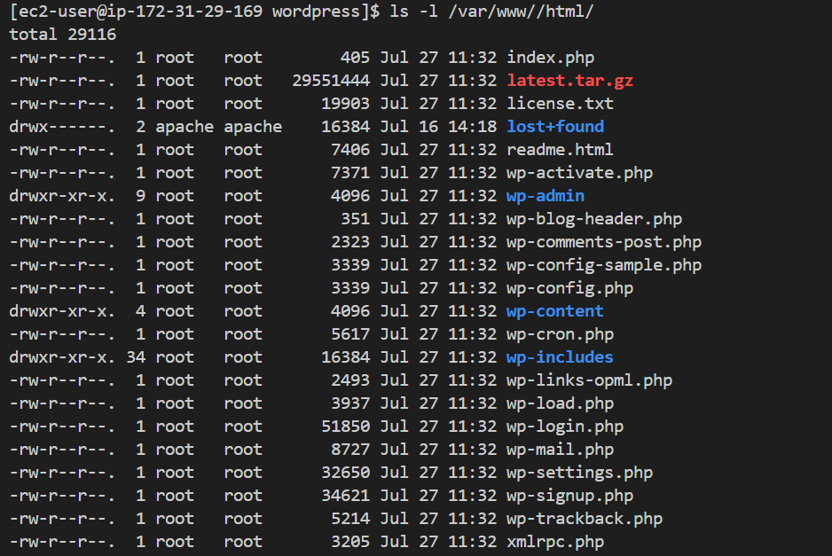

6\.  Install MySQL on DB Server EC2

Update the EC2

```
sudo yum update -y
```

Install MySQL/MariaDB Server

Check available MySQL/MariaDB packages

```
sudo dnf search mariadb
```

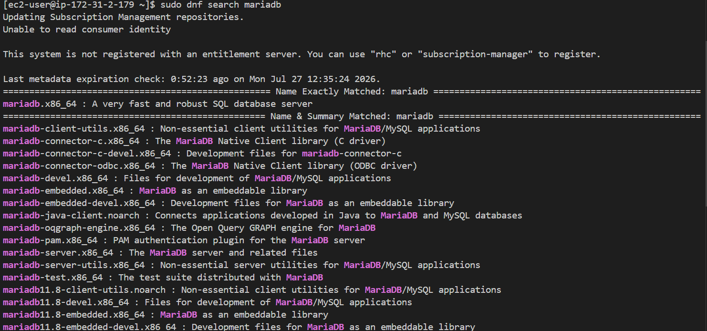

Install mariadb-server

```
sudo dnf install mariadb-server -y
```

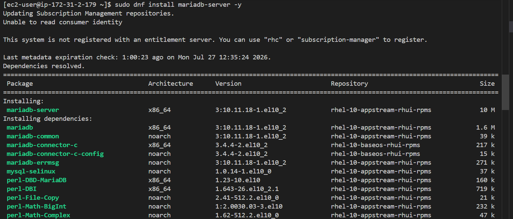


Verify that the service is up and running. If it is not running, restart the service and enable it so it will be running even after reboot.

```
sudo systemctl start mariadb
sudo systemctl enable mariadb
sudo systemctl status mariadb
```

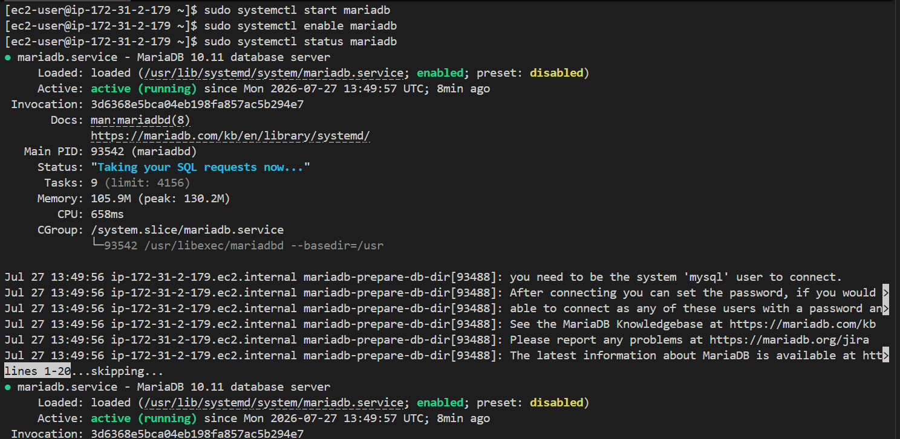

7\. Configure DB to work with WordPress

Run mysql secure script

```
sudo mysql_secure_installation
```
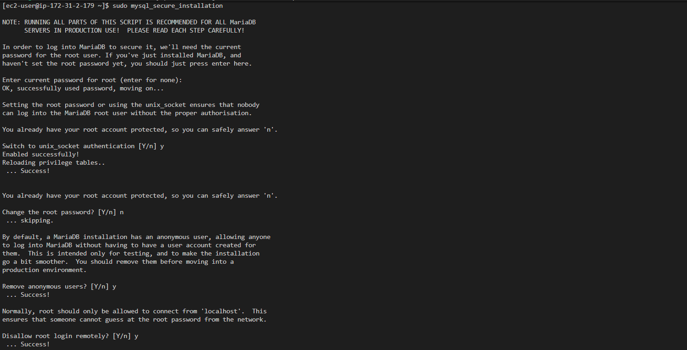

Create database

The user "wp_admin_user" will be connecting to the database using the Web Server private IP address

```
sudo mysql -u root -p
CREATE DATABASE wp_production_db;
CREATE USER 'wp_admin_user'@'172.31.29.169' IDENTIFIED BY 'Secure@wp2026';        
GRANT ALL PRIVILEGES ON wp_production_db.* TO 'wp_admin_user'@'172.31.29.169' WITH GRANT OPTION;
FLUSH PRIVILEGES;
show databases;
exit
```

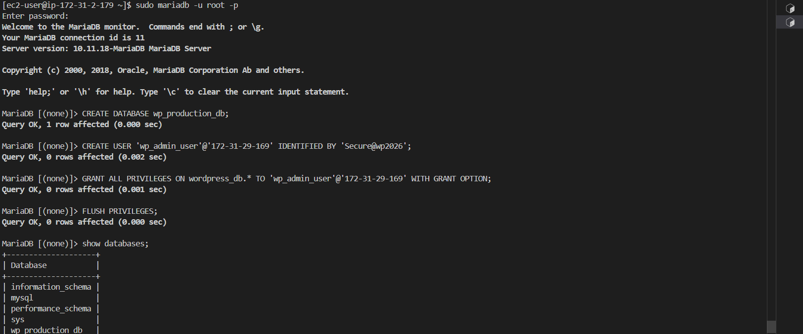

Set the bind address

The bind address is set to the private IP address of the DB Server for more security instead of to any IP address (0.0.0.0)

```
sudo vi /etc/my.cnf.d/mariadb-server.cnf
sudosystemctl restart mysqld
[mysqld]
bind-address = 172.31.2.179
```

8\. Configure WordPress to connect to remote database

Open MySQL port 3306 on the DB Server EC2.

For extra security, access to the DB Server is allowed only from the Web Server IP address. In the inbound rule, /32 is configured as source.

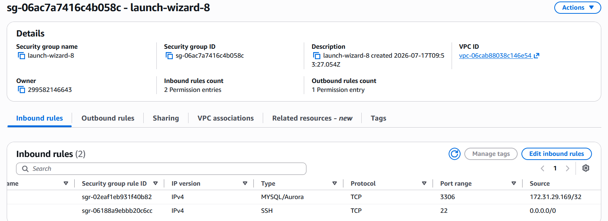

* Install MariaDB Client on the Web Server EC2.

```
sudo dnf install mariadb
```
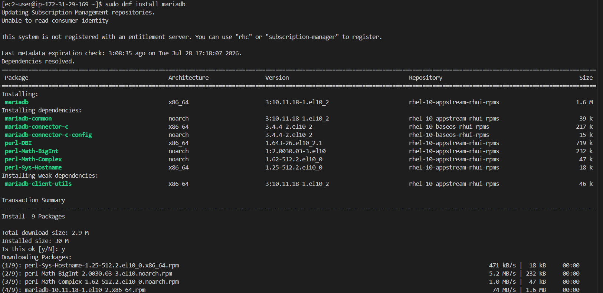

* Test Connection from Web Server

sudo mysql -u wp_admin_user -h 172.31.2.179 -p

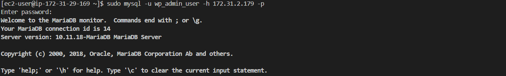

* Verify Database Connection

From your Web Server terminal, run the query to verify that your MariaDB client can communicate with the remote MariaDB server:
SQL

```
SHOW DATABASES;
```

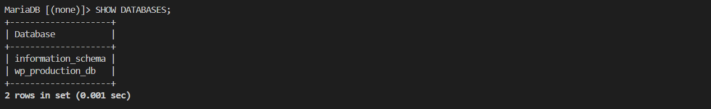


* Configure File Permissions for Apache

Ensure Apache has the correct ownership and permissions over the WordPress web directory:
Bash

Change ownership of web directory to Apache user

```
sudo chown -R apache:apache /var/www/html/
```
Set correct folder permissions

```
sudo chmod -R 755 /var/www/html/
```

Restart Apache web server to apply changes

```
sudo systemctl restart httpd
```

* Complete WordPress Installation via Browser

Open the web browser put the public ip address of the Web server

http://<Web-Server-Public-IP>/wordpress/

Open `wp-config.php` file and edit the database information

The private IP address of the DB Server is set as the `DB_HOST` because the DB Server and the Web Server resides in the same subnet which makes it possible for them to communicate directly. The private IP address is not an internet routable address.

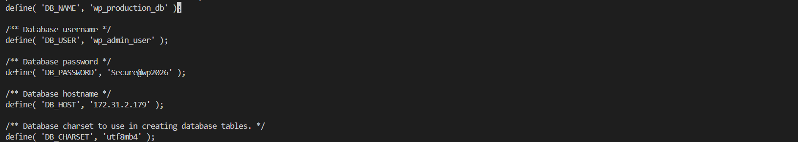

Disable the Apache default page

Here the default page can be renamed.

```
sudo mv /etc/httpd/conf.d/welcome.conf /etc/httpd/conf.d/welcome.conf_backup
```
Connect to the DB Server from the Web Server

```
sudo mysql -u wp_admin_user -h 172.31.2.179 -p
SHOW DATABASES;
exit;
```
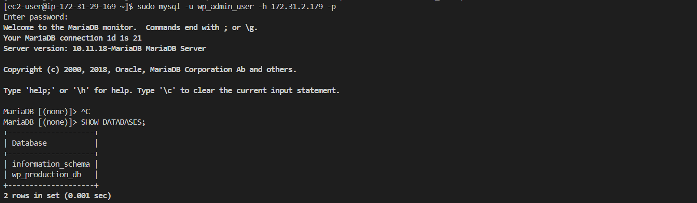

Access the web page again with the Web Server public IP address and install wordpress on the browser


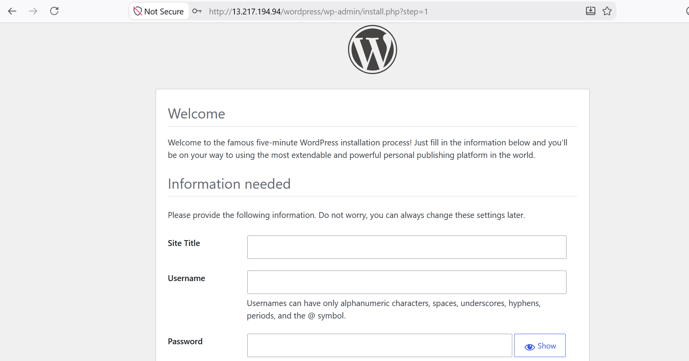
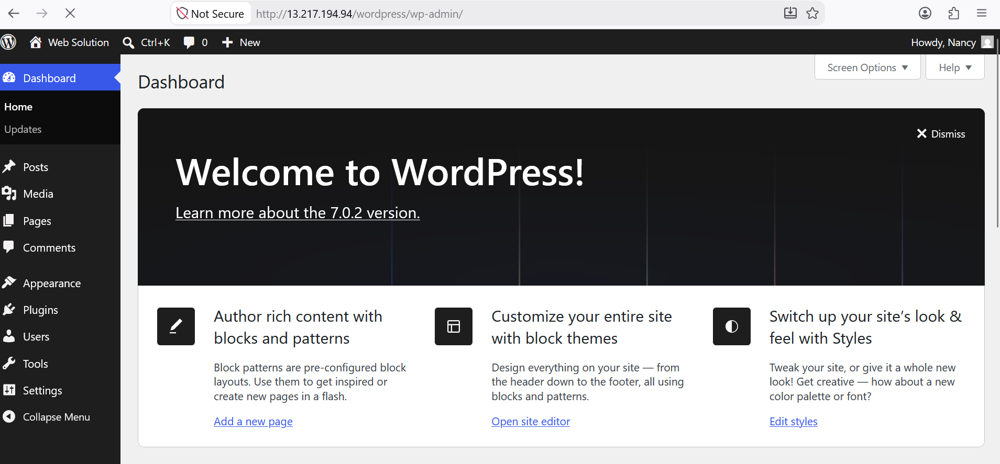

The implementation of this project is complete and WordPress is available to be used.

```
sudo umount -l /var/www/html
```